# คู่มือปฏิบัติงาน — appQC (The Precision Ledger)
## ระบบบันทึกผลการสุ่มตรวจคุณภาพสินค้า

---

### การควบคุมเอกสาร

| รายการ | รายละเอียด |
|---|---|
| **รหัสเอกสาร** | WI-QC-001 |
| **ชื่อเอกสาร** | คู่มือปฏิบัติงาน — appQC (The Precision Ledger) |
| **ฉบับที่** | 1.0 |
| **วันที่บังคับใช้** | 22 พฤษภาคม 2026 |
| **รุ่นโปรแกรม** | v2.4.0 |
| **ผู้จัดทำ** | QC System Admin |
| **ผู้ทบทวน** | _____________________ |
| **ผู้อนุมัติ** | _____________________ |
| **เอกสารที่เกี่ยวข้อง** | PRD.md, USER_STORIES.md, user-guide.md |

> **ประวัติการแก้ไข**
> - **Rev 1.0 (22 พ.ค. 2026)** — ฉบับแรก ครอบคลุม v2.4.0 (ระบบแจ้งเตือนอีเมล Reject, NCR PDF แบบ html2pdf, การกำหนดสิทธิ์ตาม Role)

---

## สารบัญ

1. [วัตถุประสงค์](#1-วัตถุประสงค์)
2. [ขอบเขต](#2-ขอบเขต)
3. [คำจำกัดความ](#3-คำจำกัดความ)
4. [ผู้รับผิดชอบ](#4-ผู้รับผิดชอบ)
5. [การเข้า-ออกระบบ](#5-การเข้า-ออกระบบ)
6. [Operator — บันทึกผล QC](#6-operator--บันทึกผล-qc)
7. [QC Admin — อนุมัติและจัดการ](#7-qc-admin--อนุมัติและจัดการ)
8. [Admin ระบบ — จัดการผู้ใช้และผู้รับแจ้งเตือน](#8-admin-ระบบ--จัดการผู้ใช้และผู้รับแจ้งเตือน)
9. [กระบวนการแจ้งเตือนอีเมล Reject](#9-กระบวนการแจ้งเตือนอีเมล-reject)
10. [บันทึกและการเก็บรักษา](#10-บันทึกและการเก็บรักษา)
11. [การแก้ไขปัญหา](#11-การแก้ไขปัญหา)

---

## 1. วัตถุประสงค์

เอกสารฉบับนี้กำหนดขั้นตอนมาตรฐานในการใช้งานโปรแกรม **appQC (The Precision Ledger)** เพื่อ:

- บันทึกผลการสุ่มตรวจคุณภาพสินค้าขาเข้า
- แจ้งเตือนผ่านอีเมลโดยอัตโนมัติเมื่อพบสินค้าสถานะ Reject
- เก็บประวัติการแก้ไขเพื่อการตรวจสอบย้อนกลับ

---

## 2. ขอบเขต

ใช้สำหรับพนักงาน QC, หัวหน้า QC และ Admin ระบบของบริษัท Comets Intertrade ทุกคนที่เข้าใช้งานโปรแกรม appQC ที่เว็บไซต์ **https://web-mocha-three-44.vercel.app**

---

## 3. คำจำกัดความ

| คำศัพท์ | คำอธิบาย |
|---|---|
| QC Order / ใบบันทึก QC | รายการบันทึกผลตรวจ 1 รายการ (เช่น `QC26050001`) |
| Lot / ล็อต | ชุดสินค้าที่รับเข้า ระบุด้วย Lot No. |
| NCR | รายงานสินค้าไม่ผ่าน — สร้างอัตโนมัติเมื่อสถานะเป็น Reject |
| Accept / ยอมรับ | ผ่านการตรวจ ไม่มีของเสีย |
| Accept Lot / ยอมรับล็อต | ผ่านการตรวจโดยมีของเสียบางส่วนแต่ยังอยู่ในเกณฑ์ |
| Reject / ปฏิเสธ | ไม่ผ่านการตรวจ ส่งคืนผู้จำหน่าย |
| % ของเสีย | (จำนวนของเสีย ÷ จำนวนตรวจสอบ) × 100 |

### บทบาท (Roles)

| Role | ชื่อเรียก | สิทธิ์โดยสรุป |
|---|---|---|
| `operator` | พนักงานหน้างาน | บันทึก QC, ดูและแก้ไข Order ของตนเอง |
| `qc_admin` | Admin ตรวจงาน | สิทธิ์ของ Operator + อนุมัติ + จัดการมาสเตอร์ Supplier/Defect/Brand + ส่ง Test mail |
| `admin` | Admin ระบบ | สิทธิ์ของ QC Admin + จัดการผู้ใช้ + จัดการผู้รับ Email |
| `viewer` | ผู้ดูข้อมูล | ดูประวัติได้อย่างเดียว |

---

## 4. ผู้รับผิดชอบ

| ตำแหน่ง | หน้าที่ |
|---|---|
| **Operator** | • ตรวจสอบสินค้าขาเข้าและบันทึกผลภายในกะเดียวกัน<br>• แนบรูปของเสียทุกครั้งที่ Reject หรือ Accept Lot<br>• ตรวจทานข้อมูลให้ครบถ้วนก่อนกดบันทึก |
| **QC Admin** | • ทบทวนและอนุมัติรายการ Reject ภายใน 1 วันทำการ<br>• ดูแลข้อมูลผู้จำหน่าย / รหัสของเสีย / Brand-Resp ให้เป็นปัจจุบัน<br>• ส่ง Email ทดสอบเป็นระยะเพื่อยืนยันว่าระบบทำงานปกติ |
| **Admin ระบบ** | • สร้างผู้ใช้และกำหนดบทบาท<br>• Reset Password ตามที่ผู้ใช้ร้องขอ<br>• จัดการรายชื่อผู้รับ Email แจ้งเตือน |

---

## 5. การเข้า-ออกระบบ

### 5.1 เข้าสู่ระบบ

**ขั้นตอน**

1. เปิดเบราว์เซอร์ → เข้า URL **https://web-mocha-three-44.vercel.app**
2. กรอก **อีเมล** ที่ Admin สร้างให้ (เช่น `sls02@cometsintertrade.com`)
3. กรอก **รหัสผ่าน**
4. คลิกปุ่ม **"เข้าสู่ระบบ"**

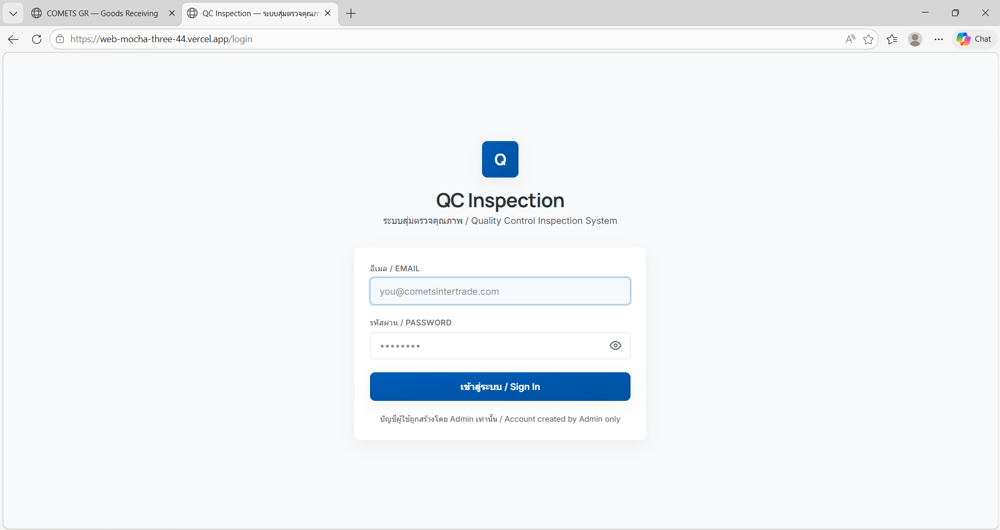

*📸 ภาพ 5.1.1 — หน้าจอเข้าสู่ระบบ*

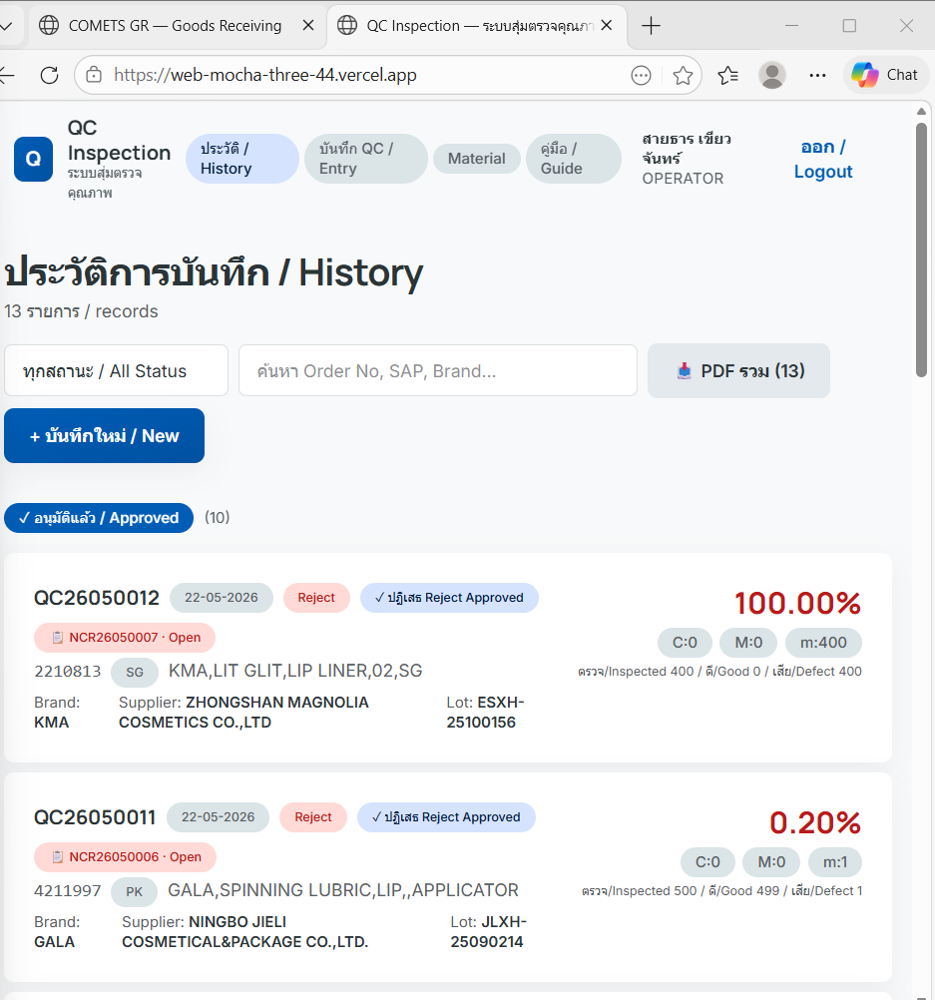

*📸 ภาพ 5.1.2 — หน้าจอหลังเข้าสู่ระบบสำเร็จ (Operator เข้าสู่หน้าประวัติ)*

**ผลลัพธ์ที่คาดหวัง**
- ✅ เข้าสู่หน้า **บันทึก QC** (Operator) หรือ **ประวัติ** ตามสิทธิ์ของ Role
- ❌ หากกรอกข้อมูลผิด → แสดงแถบสีแดงแจ้งเตือน

### 5.2 ออกจากระบบ

1. คลิกปุ่ม **"ออก"** ที่มุมขวาบน


*📸 ภาพ 5.2.1 — ตำแหน่งปุ่ม "ออก"*

> ⚠️ **สำคัญ**: ออกจากระบบทุกครั้งเมื่อเลิกใช้งานเครื่องคอมพิวเตอร์ร่วม

---

## 6. Operator — บันทึกผล QC

### 6.1 ภาพรวมขั้นตอน

```
เข้าสู่ระบบ → บันทึก QC → กรอกข้อมูลสินค้า → เลือก Defect (ถ้ามี) → กดบันทึก
                                                                       ↓
                                                  Popup สรุปผล → ดาวน์โหลด NCR (กรณี Reject)
```

### 6.2 ขั้นตอนละเอียด

#### ขั้นตอนที่ 1: เปิดหน้าบันทึก QC

คลิกแท็บ **"บันทึก QC"** ที่แถบเมนูด้านบน

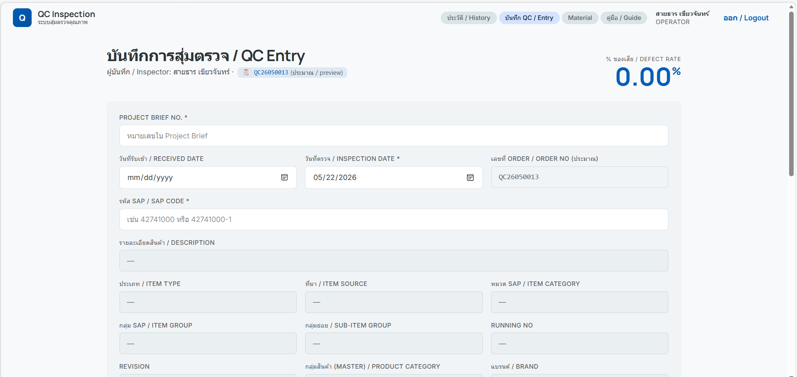

*📸 ภาพ 6.2.1 — แถบเมนูด้านบนเห็นแท็บ "บันทึก QC"*

#### ขั้นตอนที่ 2: กรอกข้อมูลส่วนหัว

| ฟิลด์ | จำเป็น | คำอธิบาย |
|---|---|---|
| **Project Brief No.** | ไม่บังคับ | กรอกหากมีโครงการที่อ้างอิง |
| **วันที่รับสินค้า** | ✅ | วันที่รับสินค้าเข้ามา |
| **วันที่ตรวจ** | ✅ | วันที่สุ่มตรวจคุณภาพ (ค่าเริ่มต้น = วันนี้) |
| **เลข Order (Preview)** | อัตโนมัติ | ขึ้นอัตโนมัติเมื่อเลือกวันที่ตรวจ (เช่น `QC26050015`) |

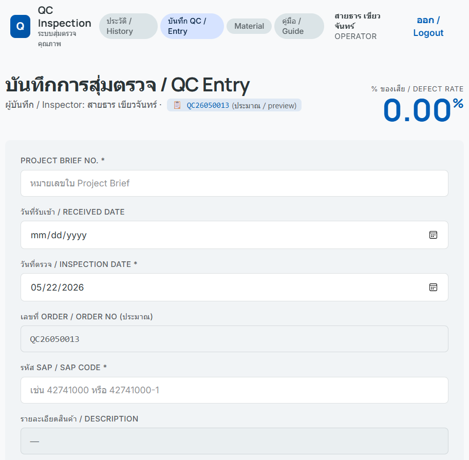

*📸 ภาพ 6.2.2 — ส่วนหัวฟอร์ม: Project Brief, วันที่รับ, วันที่ตรวจ, เลข Order*

#### ขั้นตอนที่ 3: กรอกข้อมูลสินค้า

1. กรอก **SAP Code** → ระบบจะดึงรายละเอียดสินค้า / กลุ่มสินค้า / Brand / Sales / SCM มาแสดงโดยอัตโนมัติ

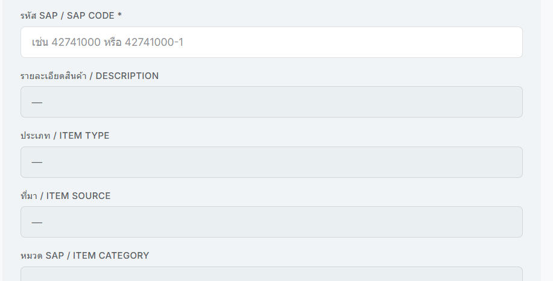

*📸 ภาพ 6.2.3 — กรอก SAP Code แล้วเห็นรายละเอียดสินค้าขึ้นอัตโนมัติ*

#### ขั้นตอนที่ 4: เลือก Supplier

1. คลิก dropdown **"รหัสผู้จัดจำหน่าย / Sup Code"**
2. รายการจะแบ่งกลุ่มเป็น: **━━━ Import (xx) ━━━** และ **━━━ Local (xx) ━━━**
3. แต่ละตัวเลือกแสดงในรูปแบบ `sap_code/sup_code` (เช่น `10000138/12Y`) พร้อมชื่อ Supplier ในช่องถัดไป
4. เลือก Supplier ที่ตรงกับสินค้า

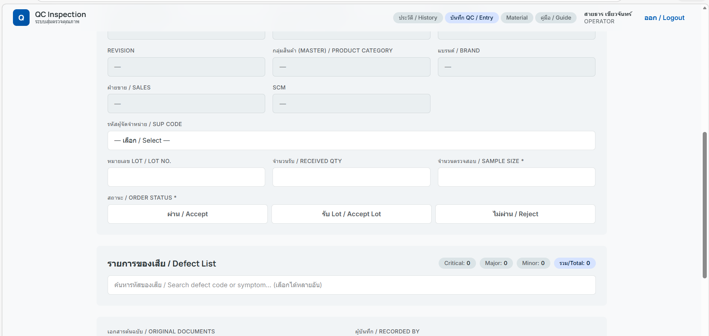

*📸 ภาพ 6.2.4 — Dropdown Sup Code เปิดแสดงกลุ่ม Import / Local*

#### ขั้นตอนที่ 5: กรอก Lot และจำนวน

| ฟิลด์ | จำเป็น | ตัวอย่าง |
|---|---|---|
| **Lot No.** | ✅ | `INV23-CWZ106` |
| **จำนวนรับ** | ✅ | `75600` |
| **จำนวนตรวจสอบ** | ✅ | `500` |

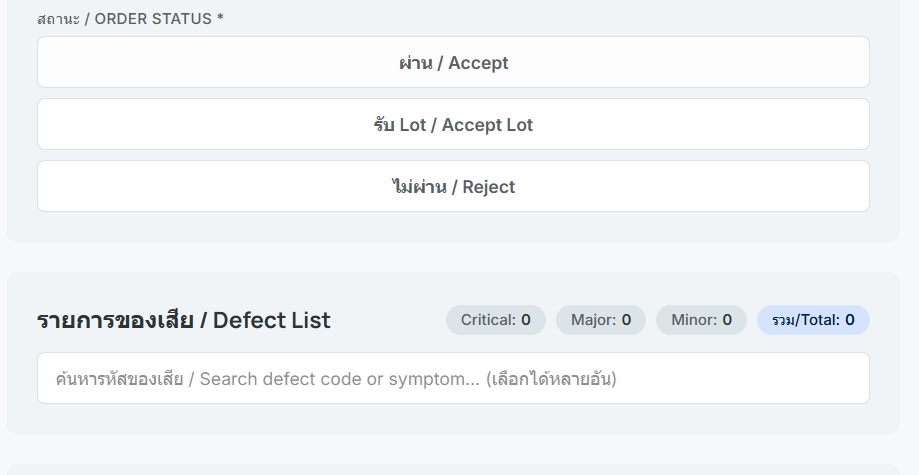

*📸 ภาพ 6.2.5 — กรอก Lot No. + จำนวนรับ + จำนวนตรวจสอบ*

#### ขั้นตอนที่ 6: เพิ่มรายการของเสีย (เฉพาะ Accept Lot หรือ Reject)

1. พิมพ์ค้นหาด้วย **รหัส** หรือ **ชื่ออาการ** ในช่องค้นหา
2. ✅ ติ๊กเลือก **หลายอาการ** ในกลุ่ม Severity เดียวกันได้
3. คลิก **"เพิ่มในรายการ"** — อาการที่เลือกจะรวมเป็น **1 แถว**
4. เลือก **ระดับความรุนแรง** — Critical / Major / Minor
5. กรอก **จำนวน** ของเสียที่พบ
6. แนบ **รูปภาพ** ของเสียได้ไม่เกิน **3 รูป** ต่อแถว (คลิกไอคอนกล้อง)

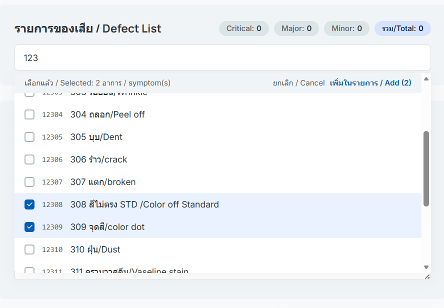

*📸 ภาพ 6.2.6 — ค้นหา Defect และติ๊กเลือกหลายรายการ*

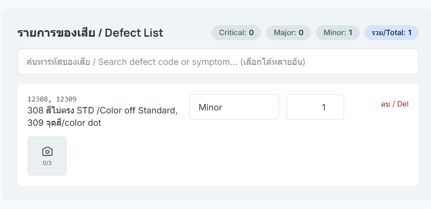

*📸 ภาพ 6.2.7 — แถวรายการ Defect แสดง Severity / จำนวน / รูปแนบ*

#### ขั้นตอนที่ 7: ตรวจสอบ % ของเสียและสถานะ

- **% ของเสีย** คำนวณอัตโนมัติแสดงที่มุมขวาบน
- **สถานะ** กำหนดอัตโนมัติตามผล:
  - `0%` → **Accept** (เขียว)
  - มีของเสียแต่อยู่ในเกณฑ์ → **Accept Lot** (เหลือง)
  - เกินเกณฑ์ → **Reject** (แดง)

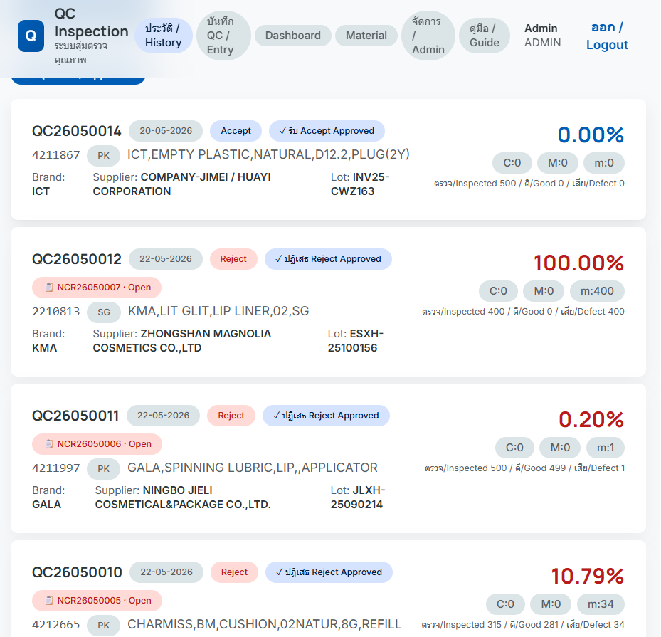

*📸 ภาพ 6.2.8 — แสดง % ของเสียและ Status chip*

#### ขั้นตอนที่ 8: เอกสารต้นฉบับและหมายเหตุ

1. เลือก **เอกสารต้นฉบับ / Original Documents** — เลือกผู้ถือเอกสารต้นฉบับ: คุณอู๋ / WH / PD / SCM / Custom
2. กรอก **หมายเหตุ** (ถ้ามี)

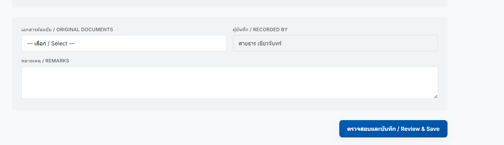

*📸 ภาพ 6.2.9 — Dropdown เอกสารต้นฉบับ + ช่องหมายเหตุ*

#### ขั้นตอนที่ 9: บันทึก

1. คลิกปุ่ม **"บันทึก"**
2. รอ Upload รูปภาพ (มีแถบโหลด)
3. **Popup สรุปผล** ขึ้นแสดงข้อมูลทั้งหมด + เลข Order (เช่น `QC26050015`)
4. **กรณีสถานะ Reject** ระบบจะ:
   - ส่ง Email พร้อมแนบไฟล์ NCR PDF ไปยังผู้รับทั้งหมดที่เปิดสถานะรับ Email โดยอัตโนมัติ
   - Status chip ใน Popup จะเปลี่ยนเป็น: `กำลังเตรียม → กำลังส่ง → ✅ ส่งสำเร็จ` (หรือ ❌ ส่งไม่สำเร็จ)
   - คลิก **"ดาวน์โหลด NCR PDF"** เพื่อบันทึกไฟล์ลงเครื่อง
5. คลิก **"ปิด"** → ฟอร์ม reset พร้อมรับ Order ถัดไป

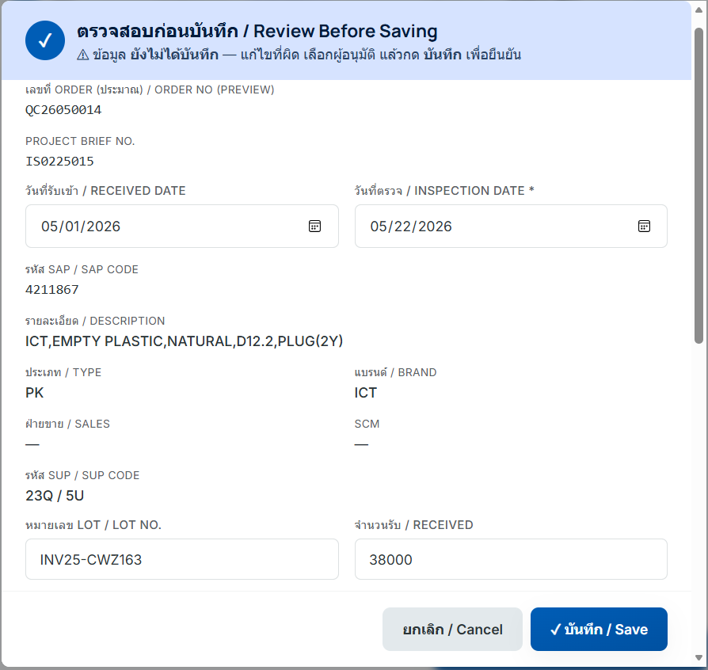

*📸 ภาพ 6.2.10 — Success Popup หลังบันทึก Reject (เห็นเลข Order, Status chip, ปุ่ม Download NCR)*

### 6.3 ดูและแก้ไขประวัติ

#### ดูประวัติ

1. คลิกแท็บ **"ประวัติ"**
2. ใช้ช่องค้นหา (เลข Order / SAP / Brand / Supplier)
3. คลิกที่แถวรายการ → เปิด **Popup** แสดงรายละเอียดเต็ม
4. คลิก **"ดาวน์โหลด NCR"** เพื่อ Download NCR PDF ซ้ำได้ (เฉพาะ Order ที่สถานะ Reject)

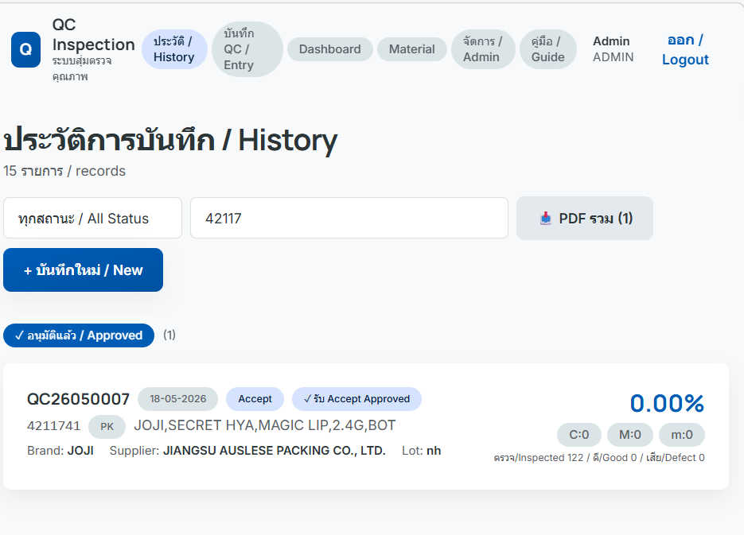

*📸 ภาพ 6.3.1 — หน้าประวัติพร้อมช่องค้นหา*

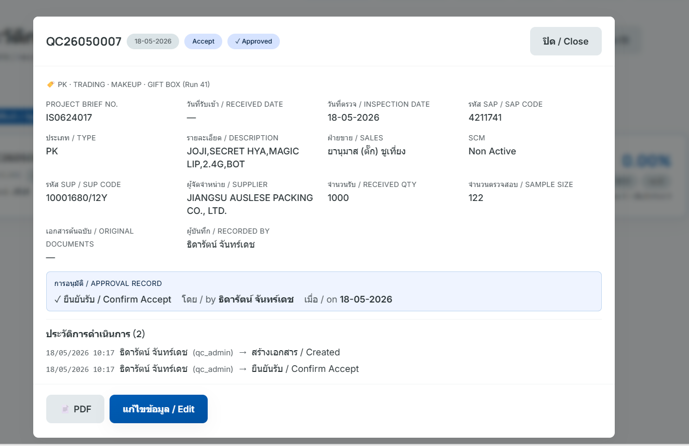

*📸 ภาพ 6.3.2 — Popup รายละเอียด Order*

#### แก้ไข Order ของตนเอง

1. เปิด Popup รายละเอียด Order ที่ตนสร้าง
2. คลิกปุ่ม **"Edit"** (ปุ่มจะแสดงเฉพาะกับผู้สร้างหรือ Admin/QC Admin เท่านั้น)
3. แก้ไขข้อมูล → คลิก **"บันทึก"**
4. หาก Order เคย **ผ่านการอนุมัติแล้ว** การอนุมัติจะถูกล้าง ต้องอนุมัติใหม่
5. การแก้ไขทุกครั้งจะถูกบันทึกใน Log (`qc_order_edit_log`) — เก็บวันเวลา + ผู้แก้ไข + รายละเอียดการเปลี่ยน

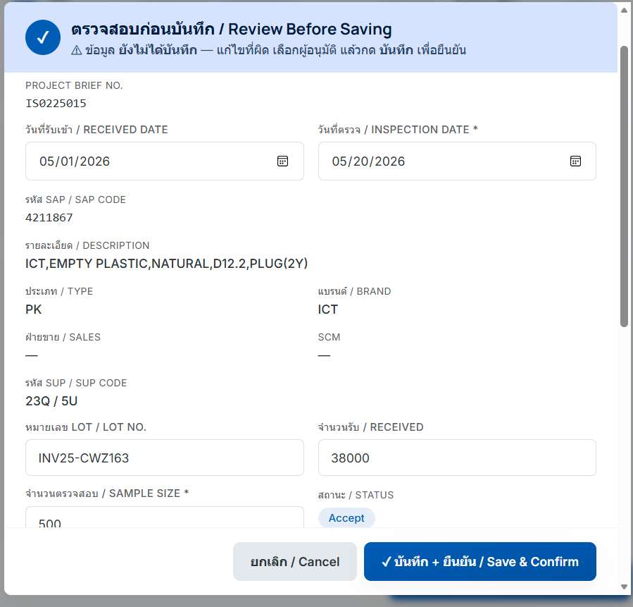

*📸 ภาพ 6.3.3 — ปุ่ม Edit ใน Popup รายละเอียด*

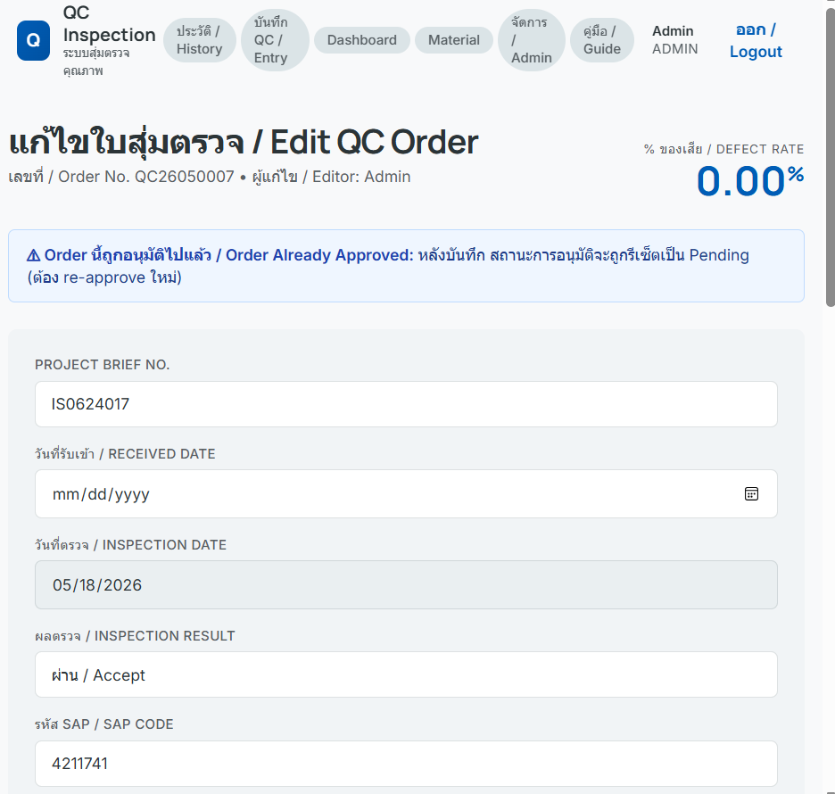

*📸 ภาพ 6.3.4 — ฟอร์มแก้ไข Order*

> ⚠️ **หมายเหตุ**: Operator แก้ไขได้เฉพาะ Order ของตนเองเท่านั้น — Admin/QC Admin แก้ไขได้ทั้งหมด

---

## 7. QC Admin — อนุมัติและจัดการ

### 7.1 อนุมัติรายการ Reject

1. เปิดหน้า **ประวัติ** → กรองสถานะ = `Reject`
2. คลิกที่ Order → เปิด Popup รายละเอียด
3. คลิกปุ่ม **"✓ ยืนยันการปฏิเสธ"** ในส่วน **การอนุมัติ / Approval Record**
4. ระบบบันทึกวันเวลาและชื่อผู้อนุมัติอัตโนมัติ

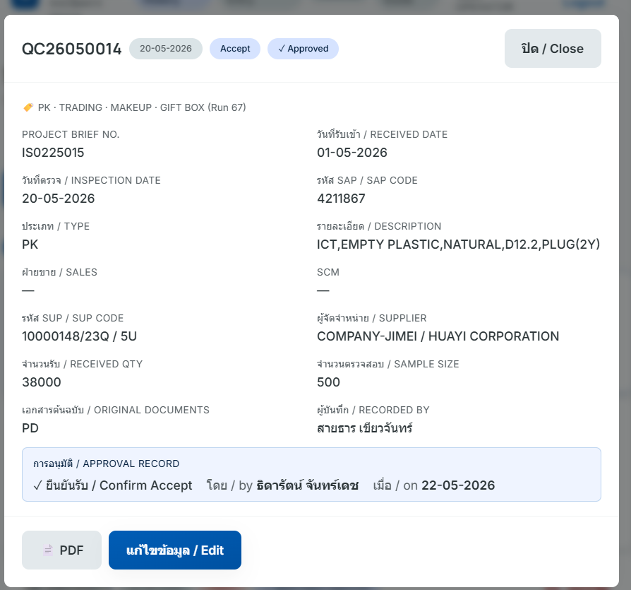

*📸 ภาพ 7.1.1 — ส่วนการอนุมัติพร้อมปุ่ม "ยืนยันการปฏิเสธ"*

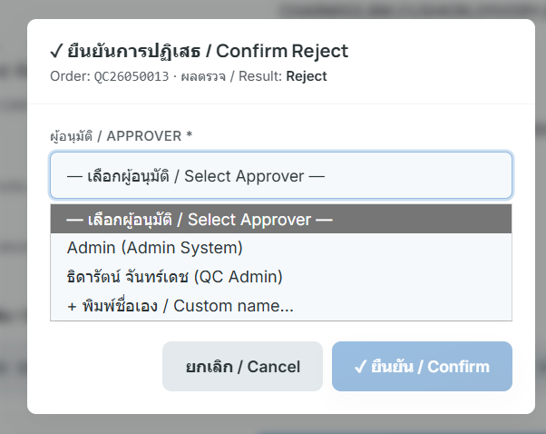

*📸 ภาพ 7.1.2 — Modal ยืนยันการปฏิเสธ พร้อม Dropdown เลือกผู้อนุมัติ*

### 7.2 จัดการ Supplier

1. คลิกแท็บ **"Admin"** → เลือก pane **"Suppliers"**
2. **เพิ่ม Supplier ใหม่**:
   - กรอก **SAP Code** (จำเป็น)
   - กรอก **Sup Code** (ไม่บังคับ — หากเว้นว่าง ระบบใช้ SAP Code แทน)
   - กรอก **ชื่อ Supplier**
   - เลือก **Purchase**: Import หรือ Local
   - คลิก **"บันทึก"**
3. **แก้ไข / ลบ** ผ่านปุ่มในแต่ละแถว

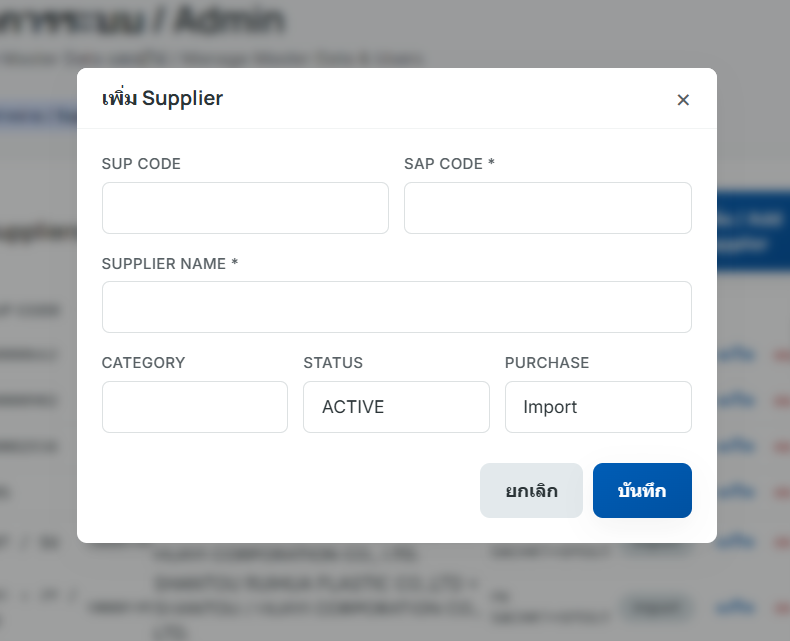

*📸 ภาพ 7.2.1 — หน้า Suppliers พร้อมฟอร์มเพิ่มข้อมูล*

### 7.3 จัดการรหัสของเสีย (Defect Codes)

1. แท็บ **Admin** → pane **Defects**
2. เพิ่ม/แก้ไข รหัส, ชื่ออาการ (TH + EN), หมวดหมู่ ตามต้องการ

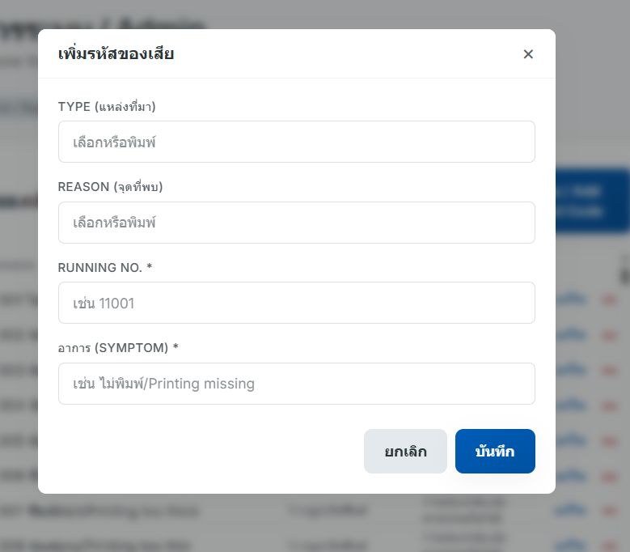

*📸 ภาพ 7.3.1 — หน้า Defects*

### 7.4 จัดการ Brand / Responsibility

1. แท็บ **Admin** → pane **Brand Resp**
2. ผูก Brand แต่ละตัวกับ Sales + SCM ผู้รับผิดชอบ

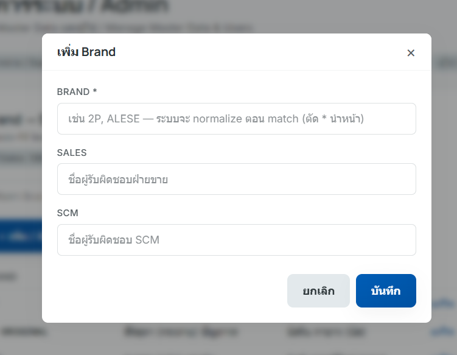

*📸 ภาพ 7.4.1 — หน้า Brand Resp*

### 7.5 Reject Notify — ส่ง Email ทดสอบและดูประวัติ

1. แท็บ **Admin** → เลือก pane **"📧 Reject Notify"**
2. **สำหรับ QC Admin (สิทธิ์ดู + ทดสอบ)**:
   - ดูรายชื่อผู้รับทั้งหมด
   - คลิก **"👁 Preview"** ที่ Order Reject ใด ๆ → เห็นเนื้อหา Email HTML + ไฟล์ NCR PDF ที่จะแนบ
   - คลิก **"📨 ส่งทดสอบ"** → ระบบส่ง Email ทดสอบไปยังผู้ใช้ที่ Login อยู่เท่านั้น (ไม่ส่งไปยังผู้รับจริง)
   - Status chip แสดง: กำลังส่ง → ✅ ส่งสำเร็จ / ❌ ส่งไม่สำเร็จ
3. **ส่วนประวัติการส่ง** แสดง 50 รายการล่าสุด:
   | เวลา | เลข Order | NCR No. | ผู้รับ | PDF | สถานะ |
   - 🟢 success / 🔴 failed / 🟡 skipped (ไม่มีผู้รับที่เปิดสถานะ)

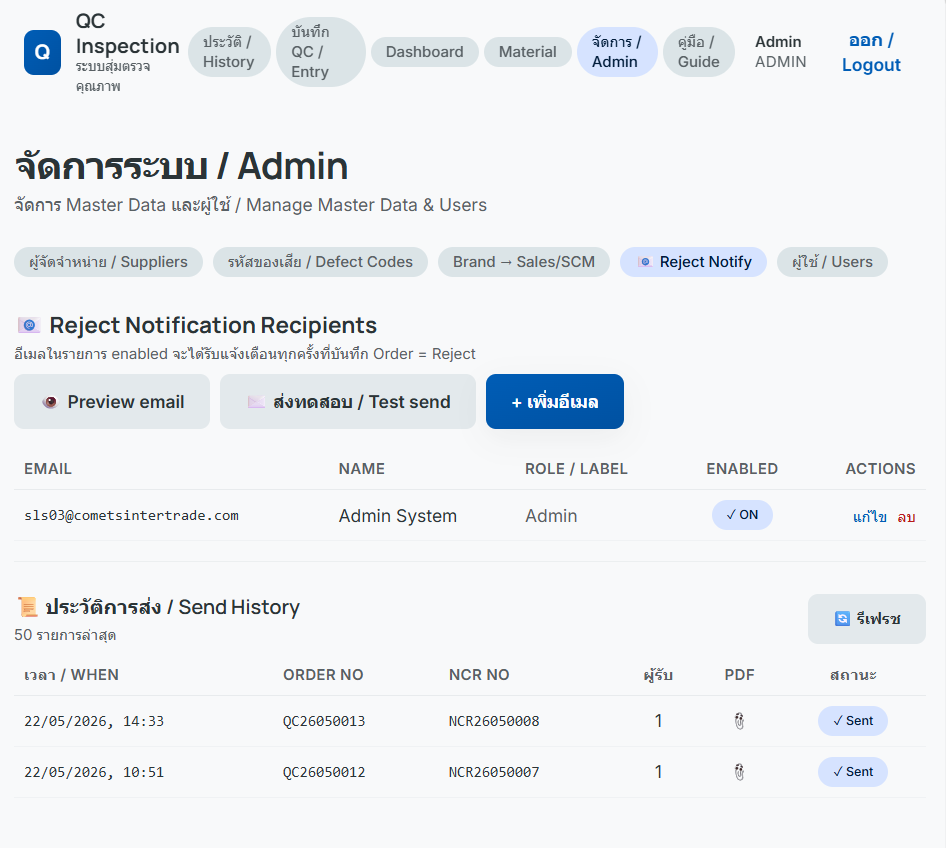

*📸 ภาพ 7.5.1 — หน้า Reject Notify พร้อมรายชื่อผู้รับ*

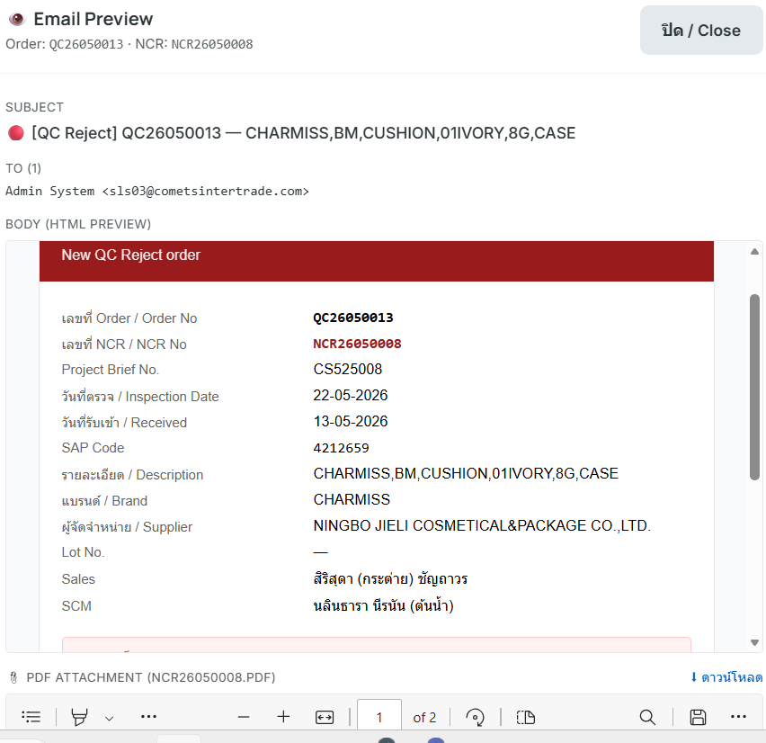

*📸 ภาพ 7.5.2 — ปุ่ม Preview + Modal แสดงตัวอย่าง Email*

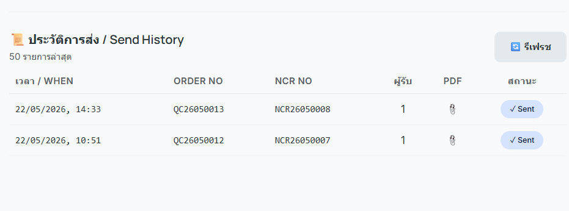

*📸 ภาพ 7.5.3 — ตารางประวัติการส่ง*

> 🔒 **สิทธิ์**: QC Admin **ดู + ส่ง Test + Preview** ได้ — เฉพาะ Admin ระบบเท่านั้นที่ **แก้ไข** รายชื่อผู้รับได้

---

## 8. Admin ระบบ — จัดการผู้ใช้และผู้รับแจ้งเตือน

### 8.1 สร้างผู้ใช้ใหม่

1. แท็บ **Admin** → pane **"Users"**
2. คลิก **"+ เพิ่มผู้ใช้"**
3. กรอกข้อมูล:
   - **อีเมล** (ต้องเป็นโดเมนบริษัท)
   - **ชื่อ-นามสกุล**
   - **Role**: operator / qc_admin / admin / viewer
   - **รหัสผ่าน** — กรอกเอง หรือคลิก **"Generate"** เพื่อสุ่มรหัสที่ปลอดภัย
4. คลิก **"บันทึก"**
5. ระบบแสดง **แถบครั้งเดียว** บอกรหัสผ่าน Plaintext — Copy แล้วส่งให้ผู้ใช้ทางช่องทางปลอดภัย

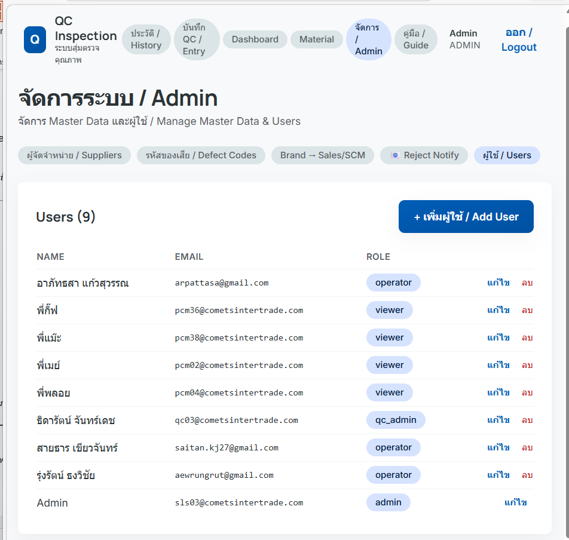

*📸 ภาพ 8.1.1 — Modal เพิ่มผู้ใช้พร้อมปุ่ม Generate Password*

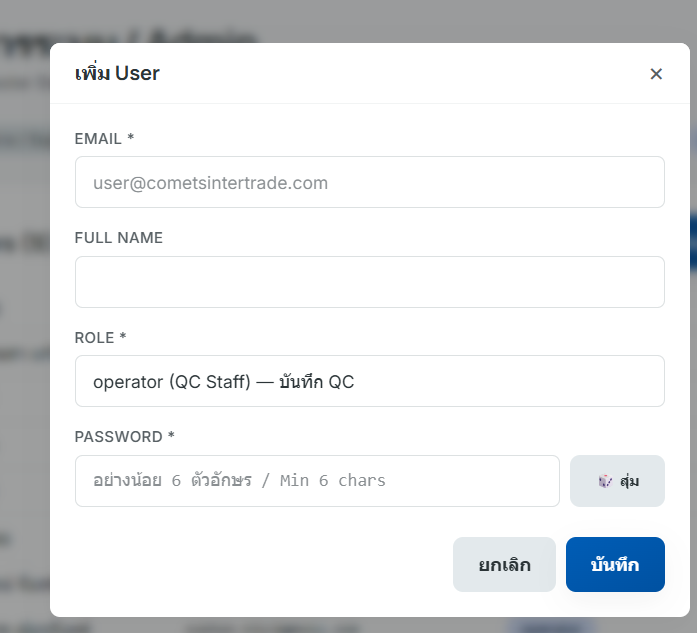

*📸 ภาพ 8.1.2 — แถบ one-time password banner*

> ⚠️ **ความปลอดภัย**: รหัสผ่านถูกเก็บแบบ Hash (bcrypt) เท่านั้น — ไม่สามารถกู้คืนค่าเดิมได้ หากผู้ใช้ลืมรหัส ต้อง **Reset** เป็นค่าใหม่

### 8.2 Reset รหัสผ่านผู้ใช้

1. **Admin** → **Users** → คลิก **"Edit"** ที่แถวผู้ใช้
2. กรอกรหัสผ่านใหม่ หรือคลิก **"Generate"**
3. คลิก **"บันทึก"**
4. แถบ one-time แสดงรหัสผ่านใหม่
5. แจ้งผู้ใช้ทางช่องทางปลอดภัย

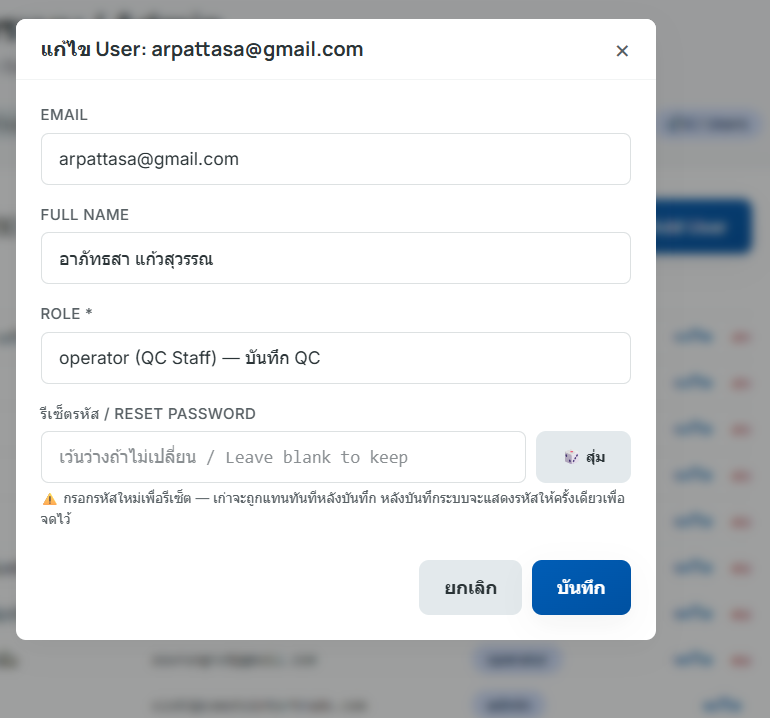

*📸 ภาพ 8.2.1 — Modal Edit User พร้อมช่อง Password + ปุ่ม Generate*

### 8.3 จัดการผู้รับ Email แจ้งเตือน

1. **Admin** → pane **"📧 Reject Notify"**
2. **เพิ่มผู้รับใหม่**:
   - อีเมล
   - ชื่อที่แสดง
   - ตำแหน่ง (เช่น Admin, Sales Manager)
   - สลับสถานะ **Enabled** (☑ = รับ Email Reject)
   - คลิก **"บันทึก"**
3. **ปิด (Disable)** แทนการลบ หากผู้รับลาหรือพักการแจ้งเตือนชั่วคราว
4. **ผู้รับเริ่มต้น** คือ `sls03@cometsintertrade.com` — ห้ามลบเว้นแต่จะเปลี่ยนผู้รับ

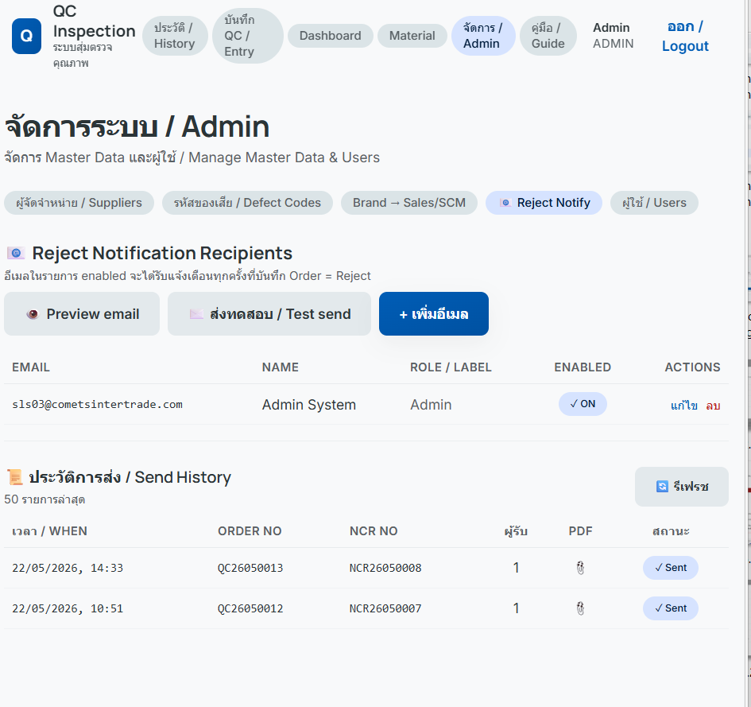

*📸 ภาพ 8.3.1 — ตารางผู้รับพร้อมปุ่ม Add / Edit / Toggle / Delete*

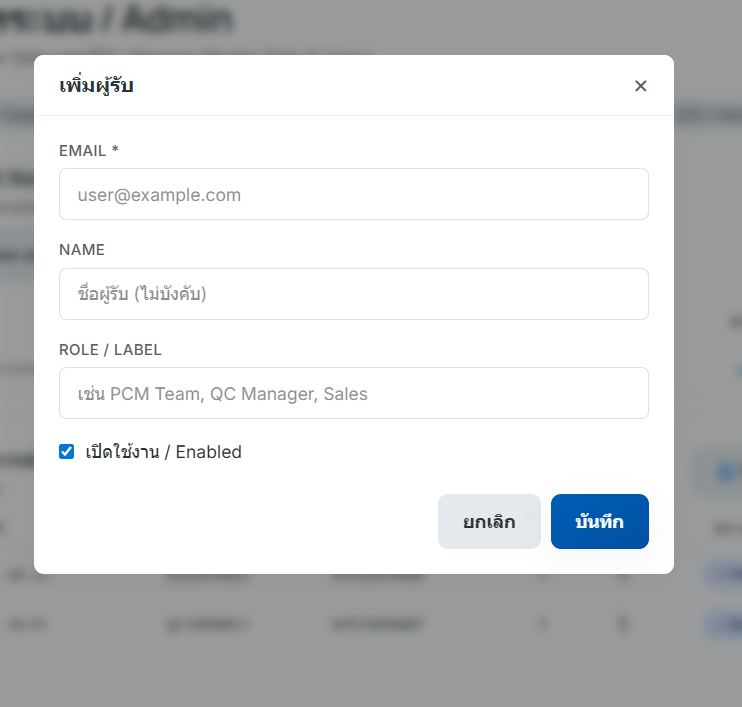

*📸 ภาพ 8.3.2 — ฟอร์มเพิ่มผู้รับใหม่*

### 8.4 ดูประวัติการแก้ไข (Activity Timeline)

1. เปิด Popup รายละเอียด Order ในหน้า **ประวัติ**
2. เลื่อนลงไปที่ **"Activity Timeline"** (ส่วนนี้เห็นเฉพาะ Admin)
3. เห็นเหตุการณ์ทั้งหมดเรียงตามเวลา: สร้าง → แก้ไข (พร้อมรายการที่เปลี่ยน) → อนุมัติ

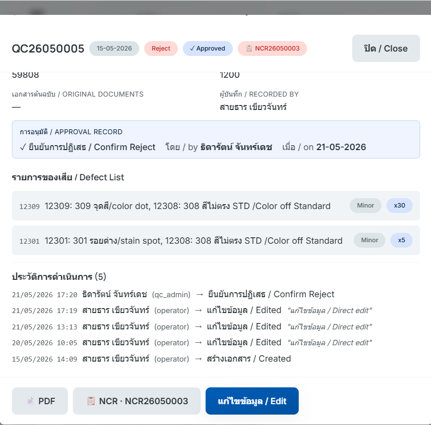

*📸 ภาพ 8.4.1 — Activity Timeline แสดงเหตุการณ์ Created / Edited / Approved*

---

## 9. กระบวนการแจ้งเตือนอีเมล Reject

### 9.1 การส่งอัตโนมัติ

```
Operator บันทึก Order Reject
        ↓
Frontend สร้าง NCR PDF แบบ offscreen (html2pdf.js)
        ↓
POST /api/notify-reject พร้อมข้อมูล { order_id, pdf_base64, pdf_filename }
        ↓
Backend ตรวจสอบสิทธิ์ → สร้าง HTML email → แนบไฟล์ PDF
        ↓
Nodemailer → Gmail SMTP → ส่งไปยังผู้รับใน notification_recipients (enabled=true)
        ↓
บันทึกแถวลงตาราง notification_send_log (success / failed / skipped)
        ↓
Frontend อัปเดต Status chip ใน Success Modal
```

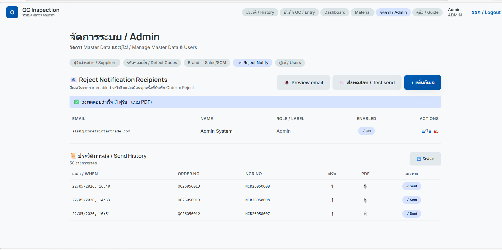

*📸 ภาพ 9.1.1 — Status chip lifecycle: กำลังเตรียม → กำลังส่ง → ✅ ส่งสำเร็จ*

### 9.2 ทดสอบส่ง Email ด้วยตนเอง

1. **Admin** → แท็บ **📧 Reject Notify**
2. ค้นหา Order Reject ที่ต้องการ
3. คลิก **"📨 ส่งทดสอบ"**
4. Email ทดสอบจะถูกส่ง **เฉพาะผู้ใช้ที่ Login อยู่** เท่านั้น (ไม่ส่งไปยังผู้รับจริง)
5. Status chip แสดงสถานะการส่ง

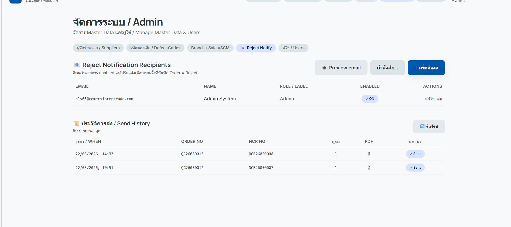

*📸 ภาพ 9.2.1 — ปุ่มส่งทดสอบ + Status chip*

### 9.3 Preview Email โดยไม่ส่งจริง

1. **Admin** → แท็บ **📧 Reject Notify**
2. คลิก **"👁 Preview"** ที่ Order Reject ใด ๆ
3. Modal แสดง:
   - **หัวข้ออีเมล**
   - **เนื้อหา HTML**
   - **รายชื่อผู้รับ**
   - **ไฟล์ NCR PDF** ที่จะแนบ (แสดงในตัว Modal)
4. คลิก **"ปิด"** เมื่อตรวจสอบเสร็จ


*📸 ภาพ 9.3.1 — Modal Preview Email พร้อม HTML + PDF*

### 9.4 ตรวจสอบประวัติการส่ง

ส่วน **"📋 ประวัติการส่ง"** ในแท็บ Reject Notify แสดงรายการส่ง Email 50 รายการล่าสุด:

| คอลัมน์ | รายละเอียด |
|---|---|
| **เวลา** | DD/MM/YYYY HH:mm |
| **เลข Order** | เช่น `QC26050015` |
| **NCR No.** | เช่น `NCR26050015` |
| **ผู้รับ** | รายชื่อ Email คั่นด้วยจุลภาค |
| **PDF** | ✅ หากแนบไฟล์ |
| **สถานะ** | 🟢 success / 🔴 failed / 🟡 skipped |


*📸 ภาพ 9.4.1 — ตารางประวัติการส่ง*

> 💡 **เคล็ดลับ**: หากสถานะ = 🔴 failed → คลิกที่แถวเพื่อดู `error_detail` ในฐานข้อมูล สาเหตุที่พบบ่อย: SMTP throttle, อีเมลผู้รับไม่ถูกต้อง, ตัวแปร SMTP ใน Vercel ไม่ครบ

---

## 10. บันทึกและการเก็บรักษา

| ประเภทบันทึก | ที่จัดเก็บ | ระยะเวลาเก็บ |
|---|---|---|
| ข้อมูล Order | Supabase ตาราง `qc_orders` + `qc_order_details` | ไม่จำกัด |
| รูปภาพของเสีย | Supabase Storage bucket `defect-photos` | ไม่จำกัด |
| ประวัติการแก้ไข | Supabase ตาราง `qc_order_edit_log` | ไม่จำกัด |
| ประวัติการส่ง Email | Supabase ตาราง `notification_send_log` | ไม่จำกัด (UI แสดง 50 รายการล่าสุด) |
| ไฟล์ NCR PDF | สร้างขณะใช้งานฝั่ง Client | ไม่เก็บไฟล์ — ดาวน์โหลดใหม่ได้ตลอด |

---

## 11. การแก้ไขปัญหา

| อาการ | สาเหตุที่เป็นไปได้ | วิธีแก้ไข |
|---|---|---|
| Login ไม่ได้ ขึ้น "Invalid credentials" | รหัสผ่านผิด หรือบัญชีถูกปิด | ติดต่อ Admin ระบบให้ Reset Password |
| Error "Could not find the 'X' column" | ยังไม่ได้รัน Patch SQL ใน Database | แจ้ง Admin ระบบให้รัน Patch ที่ขาด |
| NCR PDF ตัดขอบขวา | Browser cache เก่า | กด Hard Refresh (Ctrl + Shift + R) |
| ไม่ได้รับ Email Reject | ผู้รับถูก Disable, อยู่ใน Spam, หรือ SMTP error | ตรวจ `notification_send_log` ดูสถานะ → เปิดสถานะผู้รับใหม่ หรือส่งซ้ำ |
| ไม่เห็นปุ่ม Edit | ไม่ใช่เจ้าของ Order และไม่ใช่ Admin | แจ้งผู้สร้างหรือ QC Admin ให้แก้ไขแทน |
| Dropdown Sup Code ว่างเปล่า | ยังไม่มีข้อมูล Supplier ในระบบ | ให้ Admin ระบบเพิ่มข้อมูลที่ Admin → Suppliers |
| ส่ง Test ได้ Email แต่ไม่มี PDF แนบ | Bundle เก่ายังไม่อัปเดต | Hard Refresh เบราว์เซอร์ (Ctrl + Shift + R) |

> 📞 **ช่องทางแจ้งปัญหา**: หากปัญหาไม่อยู่ในตารางข้างต้น ติดต่อ Admin ระบบที่อีเมล `data.comets@gmail.com`

---

## สิ้นสุดเอกสาร

| รายการ | รายละเอียด |
|---|---|
| รหัสเอกสาร | WI-QC-001 |
| ฉบับที่ | 1.0 |
| วันที่บังคับใช้ | 22 พฤษภาคม 2026 |
| ทบทวนครั้งต่อไป | 22 พฤศจิกายน 2026 |
